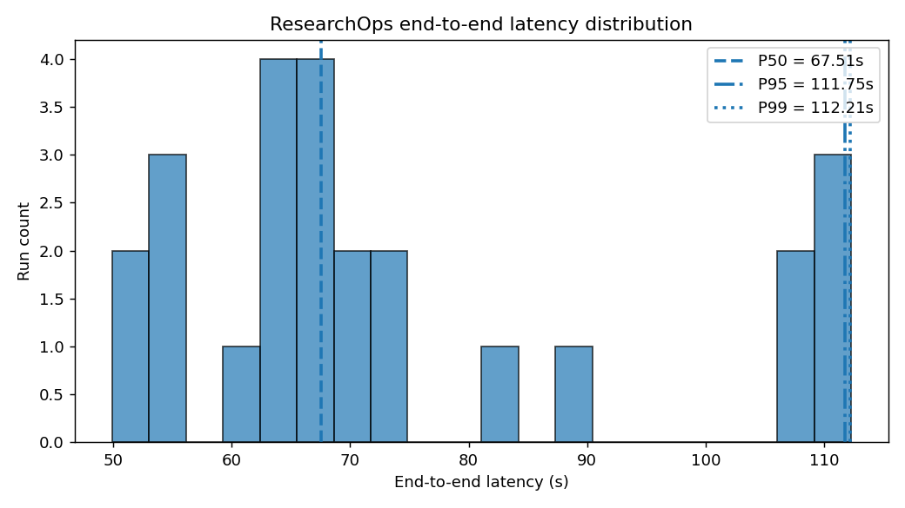
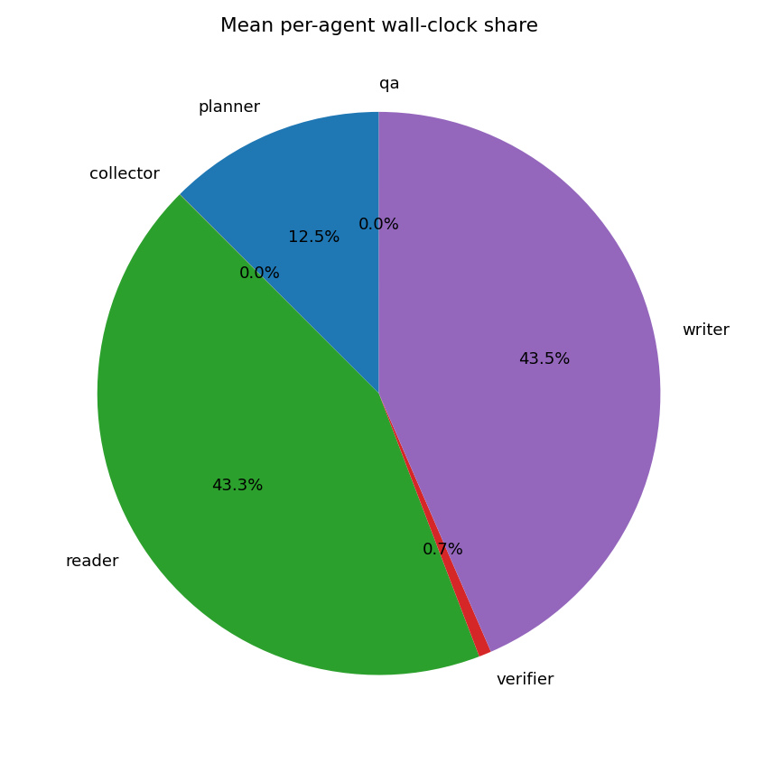
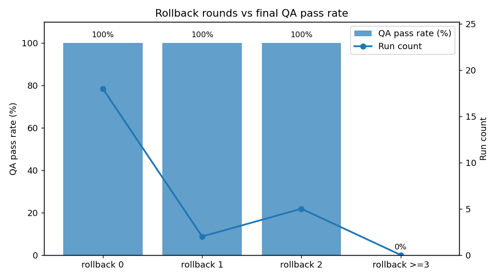

# ResearchOps Performance & Cost Benchmark

**P95 latency: 111.8s | 平均成本: ¥0.02/报告 | rollback 触发率: 28% | rollback 后 QA pass 率: 100%**

- Topics run: 25 (ok: 25, failed: 0)  
- Mock LLM: any=false, all=false  
- Pricing: DeepSeek list (input $0.14/1M, output $0.28/1M); USD→CNY = 7.2

## Latency / Cost / Quality

| Metric | Value |
|---|---|
| Latency P50 / P95 / P99 | 67.51s / 111.75s / 112.21s |
| Latency mean / max | 74.61s / 112.26s |
| Tokens mean / max / total | 13027 / 17976 / 325667 |
| Cost mean / max / total (USD) | $0.0026 / $0.0037 / $0.0647 |
| Cost mean / max / total (CNY) | ¥0.0186 / ¥0.0266 / ¥0.4659 |
| Rollback trigger rate | 28.0% |
| Post-rollback QA pass rate | 100.0% |
| Final QA pass rate (overall) | 100.0% |
| Citation coverage (mean) | 80.1% |

## Charts

## Per-agent mean wall-clock (seconds)

| Agent | Mean seconds |
|---|---|
| planner | 8.323 |
| collector | 0.008 |
| reader | 28.830 |
| verifier | 0.475 |
| writer | 28.953 |
| qa | 0.003 |
| supervisor | 0.000 |

## Per-topic results (top 25)

| # | App | Topic | Latency (s) | Tokens | Cost (¥) | Rollbacks | QA pass |
|---|---|---|---|---|---|---|---|
| 1 | research | large language model alignment via reinforcement learning from human feedback | 110.57 | 16946 | ¥0.0245 | 2 | yes |
| 2 | research | transformer attention mechanism efficiency optimization | 71.90 | 12477 | ¥0.0177 | 0 | yes |
| 3 | research | brain-computer interfaces clinical applications | 67.51 | 12240 | ¥0.0174 | 0 | yes |
| 4 | research | CRISPR gene editing therapeutic delivery | 112.05 | 17976 | ¥0.0266 | 2 | yes |
| 5 | research | magnetic confinement fusion energy net gain | 69.51 | 12703 | ¥0.0179 | 0 | yes |
| 6 | research | climate change adaptation strategies for coastal cities | 106.95 | 17327 | ¥0.0253 | 2 | yes |
| 7 | research | antibiotic resistance and novel antimicrobial discovery | 83.60 | 14611 | ¥0.0209 | 1 | yes |
| 8 | research | perovskite solar cell stability and efficiency | 63.16 | 12164 | ¥0.0169 | 0 | yes |
| 9 | research | post-quantum cryptography lattice-based schemes | 64.90 | 12176 | ¥0.0171 | 0 | yes |
| 10 | research | EU AI Act regulatory compliance for foundation models | 112.26 | 17975 | ¥0.0265 | 2 | yes |
| 11 | research | global semiconductor supply chain bottlenecks | 65.42 | 12312 | ¥0.0173 | 0 | yes |
| 12 | research | mRNA vaccine platform extensions beyond COVID-19 | 88.74 | 15354 | ¥0.0222 | 1 | yes |
| 13 | research | autonomous driving perception sensor fusion | 67.27 | 12358 | ¥0.0174 | 0 | yes |
| 14 | research | retrieval augmented generation architectures and evaluation | 62.05 | 11810 | ¥0.0165 | 0 | yes |
| 15 | research | federated learning privacy guarantees | 71.62 | 12468 | ¥0.0177 | 0 | yes |
| 16 | research | robotic manipulation learning from demonstration | 72.57 | 12642 | ¥0.0179 | 0 | yes |
| 17 | research | room-temperature superconductor evidence and reproducibility | 67.75 | 12357 | ¥0.0173 | 0 | yes |
| 18 | research | agentic LLM systems planning and tool use | 109.02 | 17810 | ¥0.0260 | 2 | yes |
| 19 | research | neural radiance fields for 3D scene reconstruction | 64.45 | 12565 | ¥0.0177 | 0 | yes |
| 20 | research | grid-scale battery storage for renewable integration | 67.41 | 12622 | ¥0.0180 | 0 | yes |
| 21 | market | NVDA competitive position in AI accelerators | 55.85 | 9827 | ¥0.0141 | 0 | yes |
| 22 | market | TSLA energy and automotive segment outlook | 54.32 | 9407 | ¥0.0136 | 0 | yes |
| 23 | market | AAPL services revenue growth and margin trajectory | 52.51 | 9322 | ¥0.0133 | 0 | yes |
| 24 | market | MSFT cloud and AI monetization roadmap | 49.91 | 9023 | ¥0.0128 | 0 | yes |
| 25 | market | GOOGL search moat under generative AI disruption | 53.89 | 9195 | ¥0.0133 | 0 | yes |

_Generated by `scripts/run_benchmark.py`. QA pass = pipeline emitted a `(stage=QA, action=complete)` event (no high-severity issues, or rollback budget exhausted). Per-agent times are summed across rollback rounds._
